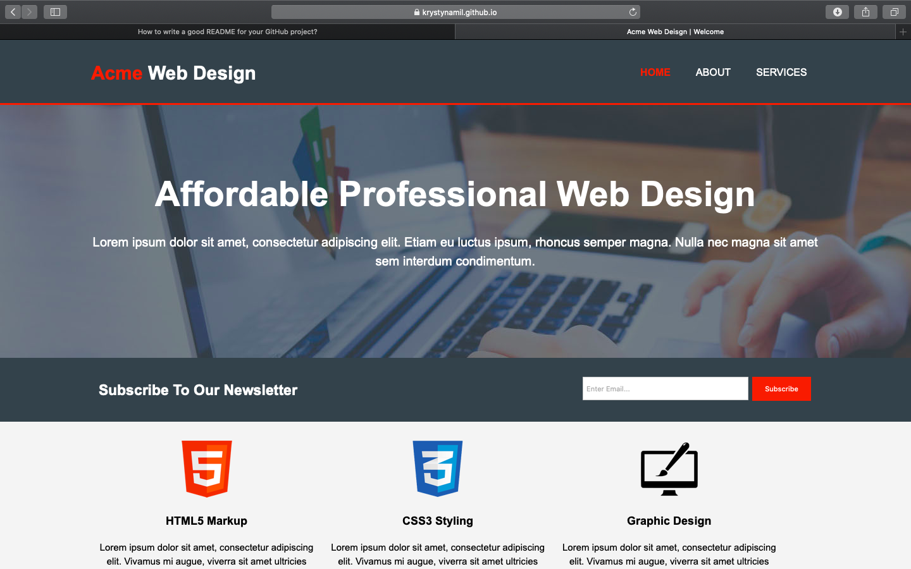

# Acme Web Design

Professional web design company

## Table of contents

* [General info](#general-info)
* [Screenshots](#screenshots)
* [Technologies](#technologies)
* [Setup](#setup)
* [Status](#status)
* [Contributing](#contributing)
* [License](#license)

## General info

Affordable and Professional web design company website.
Which provide the services as website design,  maintenance  and hosting.

## Screenshots

## Technologies

Project is created with:

* HTML5
* CSS
* Responsive layout

## Setup

[Acme Web Design Demo](https://krystynamil.github.io/acme-web-design/index.html)

## Status

Project is: finished

## Contributing

Pull requests are welcome. For major changes, please open an issue first to discuss what you would like to change.

## License

[MIT](https://github.com/KrystynaMil/acme-web-design/blob/master/LICENSE)
