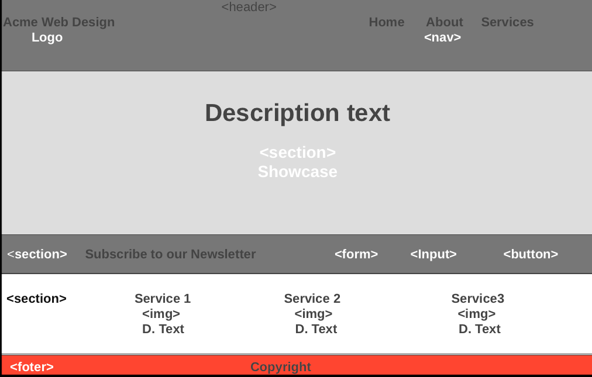

---

# Development Strategy

> `Acme-Web-Design`

- Wep page about professional web design
- For the visitors who wants to create their own website
- Our web services:
  - Website Design
  - Website Maintenance
  - Website Hosting

## Wireframe

## Set-Up

__Developer: [Repository](https://github.com/KrystynaMil/acme-web-design)__  
__Visitor: [Website](https://krystynamil.github.io/acme-web-design/)__

### Branch

1. Create a new repository [generated](https://github.blog/2019-06-06-generate-new-repositories-with-repository-templates/) from [this template](https://github.com/hackyourfuturebelgium/w3-validation-template)
1. Clone the repository
1. Change `development-strategy.md` file
1. Add [Wireframe](./wireframe.gif)
1. Start  README file
1. Push the changes
1. Turn on GitHub Pages

---

## 1. Folders and empty files

- Add `img` folder using Git and images files
- Add `css` folder and `style.css` file

---

## 2. Home Page

[__Acme Web Design Welcome__](https://krystynamil.github.io/acme-web-design/index.html)

### Branches

1. This user story was developed on a brach called `home`
1. It was merged to `master` when the feature was finished.

### HTML

- Create `index.html` file
- `Header` element with a title describing the web page
- `Navigation bar` with `ul` list
- `Form` with `ìnput` and `button`
- `Section` with `ìmg` and information about the services
- Pleasant `footer`

### CSS

- Styling the elements: `Body` `Global` `Header` `Showcase` `Newsletter` `Boxes`

---

## 3. About page

[__Acme Web Design About__](https://krystynamil.github.io/acme-web-design/about.html)

### Branches

1. This user story was developed on a brach called `about`
1. It was merged to `master` when the feature was finished.

### HTML

- Add `about.html` file
- `Section` element
- `Article` element
- `Aside` element
- some nice text in the section introducing users to this web page

### CSS

- Styling for the new elements : `Global` `Main-col` `Sidebar`

---

## 4. Services page

[__Acme Web Design Services__](https://krystynamil.github.io/acme-web-design/services.html)

### Branches

1. This user story was developed on a brach called `services`
1. It was merged to `master` when the feature was finished.

### HTML

- Change `section` element
- Change `article` element and add `ul`list services
- Change `aside` element with other name

### CSS

- Styling for the new element: `Services`

---

## 5. Style CSS

### CSS

- Change and add styles for `style.css` file
- Add responsive layout, mobile friendly `HTML5` website

---

## 6. Finishing Touches

- Write final, complete [README](https://github.com/KrystynaMil/acme-web-design/blob/master/README.md)
  
- Validate code to check for any last mistakes
